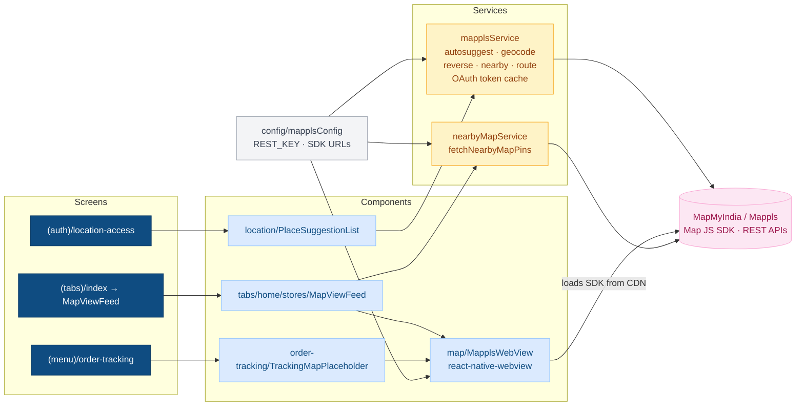

# Apana Store — Customer App Architecture

> **Generated artifact for code review.** Out of date the moment files move — re-generate by asking Claude to "rebuild the architecture graph". Do **not** hand-maintain.
>
> Last generated: 2026-04-23

---

## Layer model

```
expo-router screens          ← thin orchestrators (~100–150 LOC)
       │
       ▼
named components             ← one component per file, dumb on props
       │
       ▼
service stubs (async)        ← single backend swap point
       │
       ▼
mock data + types            ← shape the backend will return
       │
       ▼
theme + context              ← cross-cutting (theme, auth, cart, location)
```

Every screen is a slim orchestrator. State + handlers stay in the screen, JSX delegates to named components. Components never call services directly — they take callbacks. Services own all I/O. Data files own all types and mock seeds.

---

## High-level architecture graph

```mermaid
graph TD
  classDef screen   fill:#0F4C81,color:#fff,stroke:#0B3B66,stroke-width:1px
  classDef comp     fill:#DBEAFE,color:#0F4C81,stroke:#93C5FD
  classDef svc      fill:#FEF3C7,color:#92400E,stroke:#F59E0B
  classDef data     fill:#DCFCE7,color:#166534,stroke:#86EFAC
  classDef ctx      fill:#EDE9FE,color:#5B21B6,stroke:#C4B5FD
  classDef theme    fill:#FCE7F3,color:#9D174D,stroke:#F9A8D4
  classDef ext      fill:#F3F4F6,color:#374151,stroke:#9CA3AF,stroke-dasharray:4 3

  %% ── Layers ───────────────────────────────────────────────
  subgraph L1["app/ — expo-router screens"]
    AUTH["(auth)/<br/>login · otp · get-started<br/>create-account · location-access<br/>edit-profile · notifications"]:::screen
    TABS["(tabs)/<br/>index (home) · category · cart<br/>bharat · profile"]:::screen
    MENU["(menu)/<br/>store-detail · product-detail · search-results<br/>checkout · checkout-payment · order-tracking<br/>order-qr · order-collected · invoice<br/>order-history · favourite · scanner<br/>address-book · payment-methods · add-payment<br/>brands · new-launchers · offer-zone<br/>store-live · store-qr · product-finder<br/>about-us · sell-ondc · help-support<br/>language · rate-us · notifications"]:::screen
  end

  subgraph L2["components/ — named UI"]
    C_TABS["tabs/<br/>home · category · bharat · profile"]:::comp
    C_STORE["store/ store-live/ qr/<br/>product-detail/ search-results/"]:::comp
    C_CART["cart/ checkout/ payment/ invoice/<br/>orders/ order-tracking/ order-qr/<br/>order-collected/"]:::comp
    C_AUTH["auth/ otp/ onboarding/<br/>notifications/ help/ language/<br/>rate/ offer-zone/ new-launchers/<br/>brands/"]:::comp
    C_MAP["map/MapplsWebView<br/>location/PlaceSuggestionList"]:::comp
    C_SHARED["shared/<br/>(reusable primitives)"]:::comp
  end

  subgraph L3["services/ — backend swap points"]
    S_CHK["checkoutService<br/>validatePromoCode · placeOrder"]:::svc
    S_INV["invoiceService<br/>fetchInvoice"]:::svc
    S_PAY["paymentService<br/>addPaymentMethod"]:::svc
    S_NEAR["nearbyMapService<br/>fetchNearbyMapPins"]:::svc
    S_SEARCH["searchService<br/>fetchSearchResults"]:::svc
    S_MAP["mapplsService<br/>autosuggest · geocode · reverse<br/>nearbyPlaces · getRoute · token"]:::svc
  end

  subgraph L4["data/ — types + mocks"]
    D_CART["cartData<br/>FulfillmentMode · CartItem"]:::data
    D_STORE["storeDetailData · storeLiveData<br/>nearbyStoresData · b2cStoresData<br/>wholesaleStoresData · serviceStoresData<br/>nearbyMapData"]:::data
    D_PRODUCT["productDetailData · groceryData<br/>fashionData · categoryData<br/>categoryFeedData · searchResultsData<br/>brandsData · newLaunchersData<br/>offerZoneData · allFeedData · homeData"]:::data
    D_ORDER["orderHistoryData · orderTrackingData<br/>orderQrData · orderCollectedData<br/>invoiceData · checkoutData<br/>paymentData · addPaymentData"]:::data
    D_USER["profileData · addressData<br/>favouriteData · notificationsData<br/>onboardingData · helpData · languageData"]:::data
    D_BHARAT["bharatData · stateSvgData"]:::data
  end

  subgraph L5["context/ — cross-cutting state"]
    CTX_AUTH["AuthContext<br/>useAuth() — user · isGuest · login · logout<br/>(AsyncStorage)"]:::ctx
    CTX_CART["CartContext<br/>useCart() — items · add · remove · clear"]:::ctx
    CTX_LOC["LocationContext<br/>useLocation() — selectedAddress<br/>(AsyncStorage)"]:::ctx
  end

  subgraph L6["theme/ — design system"]
    T_THEME["ThemeContext + useTheme<br/>colors · isDark · brand"]:::theme
    T_TYPO["typography<br/>Poppins · ss → xxl scale"]:::theme
    T_RESP["responsive<br/>spacing · columns · isTablet"]:::theme
  end

  subgraph L7["config/ + external"]
    CFG["config/mapplsConfig<br/>REST_KEY · CLIENT_ID · CLIENT_SECRET<br/>SDK URLs · DEFAULT_LAT/LNG/ZOOM"]:::ext
    EXT_MAPPLS["MapMyIndia (Mappls)<br/>Map JS SDK · Places · Routing<br/>Geocoding · Nearby"]:::ext
    EXT_STORE["AsyncStorage<br/>(@react-native-async-storage)"]:::ext
    EXT_WV["react-native-webview<br/>(hosts Mappls Map JS SDK)"]:::ext
  end

  %% ── Root layout wiring (app/_layout.tsx) ─────────────────
  ROOT["app/_layout.tsx<br/>ThemeProvider › AuthProvider › LocationProvider › CartProvider › Stack"]
  ROOT --> CTX_AUTH
  ROOT --> CTX_CART
  ROOT --> CTX_LOC
  ROOT --> T_THEME
  ROOT --> AUTH
  ROOT --> TABS
  ROOT --> MENU

  %% ── Layer flow ───────────────────────────────────────────
  AUTH --> C_AUTH
  AUTH --> C_MAP
  TABS --> C_TABS
  TABS --> C_MAP
  MENU --> C_STORE
  MENU --> C_CART
  MENU --> C_MAP
  C_TABS --> C_SHARED
  C_STORE --> C_SHARED
  C_CART --> C_SHARED

  %% ── Screens → services ───────────────────────────────────
  MENU --> S_CHK
  MENU --> S_INV
  MENU --> S_PAY
  MENU --> S_SEARCH
  C_TABS -.via MapViewFeed.-> S_NEAR
  C_MAP --> S_MAP

  %% ── Services → data ──────────────────────────────────────
  S_CHK --> D_CART
  S_NEAR --> D_STORE
  S_INV --> D_ORDER
  S_PAY --> D_ORDER
  S_SEARCH --> D_PRODUCT

  %% ── Components → data ────────────────────────────────────
  C_TABS --> D_PRODUCT
  C_TABS --> D_STORE
  C_TABS --> D_BHARAT
  C_STORE --> D_STORE
  C_STORE --> D_PRODUCT
  C_CART --> D_ORDER
  C_CART --> D_CART
  C_AUTH --> D_USER

  %% ── Cross-cutting context ────────────────────────────────
  AUTH -. useAuth .-> CTX_AUTH
  AUTH -. useLocation .-> CTX_LOC
  TABS -. useAuth .-> CTX_AUTH
  TABS -. useCart .-> CTX_CART
  TABS -. useLocation .-> CTX_LOC
  MENU -. useCart .-> CTX_CART
  MENU -. useLocation .-> CTX_LOC

  %% ── Theme used everywhere ────────────────────────────────
  AUTH -. useTheme .-> T_THEME
  TABS -. useTheme .-> T_THEME
  MENU -. useTheme .-> T_THEME
  C_TABS -. useTheme .-> T_THEME
  C_STORE -. useTheme .-> T_THEME
  C_CART -. useTheme .-> T_THEME
  C_AUTH -. useTheme .-> T_THEME
  C_MAP -. useTheme .-> T_THEME

  %% ── External integrations ────────────────────────────────
  C_MAP --> EXT_WV
  EXT_WV --> EXT_MAPPLS
  S_MAP --> EXT_MAPPLS
  CFG --> EXT_MAPPLS
  C_MAP --> CFG
  S_MAP --> CFG
  CTX_AUTH --> EXT_STORE
  CTX_LOC --> EXT_STORE

  %% ── Context → data seeds ─────────────────────────────────
  CTX_LOC --> D_USER
```



---

## Cross-app flow: Mappls



**Key decisions**
- WebView strategy keeps the project in **Expo managed workflow** (no bare-workflow native modules).
- `mapplsService.ts` is the only direct REST caller — components never touch Mappls endpoints.
- `MapplsWebView` is the only WebView wrapper; both store discovery and order tracking reuse it.
- Auto-syncs `markers` / `routeLine` / `userLocation` props after mount via `injectJavaScript`, with a queued message bus on the page side that buffers calls until `mappls.ready` fires.

---

## Cross-app flow: Auth

```mermaid
graph LR
  classDef screen fill:#0F4C81,color:#fff
  classDef ctx    fill:#EDE9FE,color:#5B21B6,stroke:#C4B5FD
  classDef ext    fill:#F3F4F6,color:#374151,stroke:#9CA3AF

  RL[app/_layout.tsx<br/>AuthProvider]
  CTX[AuthContext<br/>user · isGuest · login · logout · skipAsGuest]:::ctx
  AS[(AsyncStorage<br/>@apana/auth)]:::ext

  GS[(auth)/get-started]:::screen
  LOGIN[(auth)/login]:::screen
  OTP[(auth)/otp]:::screen
  PROF[(tabs)/profile]:::screen
  CART[(tabs)/cart]:::screen

  RL --> CTX
  CTX <--> AS
  GS -. useAuth .-> CTX
  LOGIN -. useAuth .-> CTX
  OTP -. login() .-> CTX
  PROF -. useAuth/logout .-> CTX
  CART -. useAuth .-> CTX

  GS --> LOGIN --> OTP -. on success .-> TABS[(tabs)]
  GS -. skipAsGuest .-> TABS
```

---

## Cross-app flow: Cart

```mermaid
graph LR
  classDef screen fill:#0F4C81,color:#fff
  classDef ctx    fill:#EDE9FE,color:#5B21B6,stroke:#C4B5FD
  classDef svc    fill:#FEF3C7,color:#92400E,stroke:#F59E0B
  classDef data   fill:#DCFCE7,color:#166534,stroke:#86EFAC

  CTX[CartContext<br/>items · add · remove · clear · totals]:::ctx
  CD[data/cartData<br/>FulfillmentMode · CartItem]:::data
  CHK[checkoutService<br/>validatePromoCode<br/>placeOrder]:::svc
  PD[(menu)/product-detail]:::screen
  CART[(tabs)/cart]:::screen
  CHKO[(menu)/checkout]:::screen
  PAY[(menu)/checkout-payment]:::screen
  QR[(menu)/order-qr]:::screen
  TRACK[(menu)/order-tracking]:::screen
  OK[(menu)/order-collected]:::screen

  CTX --> CD
  CHK --> CD

  PD -. useCart.add .-> CTX
  CART -. useCart .-> CTX
  CHKO -. useCart .-> CTX
  PAY -. useCart .-> CTX
  QR -. useCart .-> CTX

  CART --> CHKO --> PAY --> CHK
  CHK -. StoreOrderResult .-> QR
  QR --> TRACK --> OK
```

**Key decision** — cart is **multi-store**. `StoreOrderResult` carries the per-store breakdown through the QR → tracking → collected chain so each store handover is verified independently.

---

## Cross-app flow: Location

```mermaid
graph LR
  classDef screen fill:#0F4C81,color:#fff
  classDef ctx    fill:#EDE9FE,color:#5B21B6,stroke:#C4B5FD
  classDef data   fill:#DCFCE7,color:#166534,stroke:#86EFAC
  classDef ext    fill:#F3F4F6,color:#374151,stroke:#9CA3AF

  CTX[LocationContext<br/>selectedAddress<br/>setSelectedAddress]:::ctx
  AD[data/addressData<br/>UserAddress · SAVED_ADDRESSES]:::data
  AS[(AsyncStorage<br/>@apana/selected-address)]:::ext

  LA[(auth)/location-access]:::screen
  HOME[(tabs)/index]:::screen
  AB[(menu)/address-book]:::screen
  NL[(menu)/new-launchers]:::screen
  CHKO[(menu)/checkout]:::screen
  OTP[(auth)/otp]:::screen
  LOGIN[(auth)/login]:::screen
  GS[(auth)/get-started]:::screen

  CTX <--> AS
  CTX --> AD

  LA -. setSelectedAddress .-> CTX
  AB -. useLocation .-> CTX
  NL -. useLocation .-> CTX
  CHKO -. useLocation .-> CTX
  HOME -. useLocation .-> CTX
  GS -. useLocation .-> CTX
  LOGIN -. useLocation .-> CTX
  OTP -. useLocation .-> CTX
```

---

## Backend swap surface

When the real backend is ready, the **only files that change** are the six service stubs. Every component / screen / data interface stays put.

| Service | Endpoint(s) it will hit | Used by screen(s) |
|---|---|---|
| `checkoutService` | `POST /promo/validate`, `POST /orders` | `checkout`, `checkout-payment` |
| `invoiceService` | `GET /orders/:id/invoice` | `invoice` |
| `paymentService` | `POST /payment-methods`, `GET /payment-methods` | `payment-methods`, `add-payment` |
| `nearbyMapService` | `GET /stores/nearby?lat=&lng=&radius=` | `MapViewFeed` (home stores) |
| `searchService` | `GET /search?q=&sort=` | `search-results` |
| `mapplsService` | Mappls REST (token, autosuggest, geocode, nearby, route) | `location-access`, `MapViewFeed`, future routing |

---

## Hard rules (from CLAUDE.md)

1. **Slim orchestrators** — screens stay ~100–150 LOC. JSX delegates to named components.
2. **Theme + typography always** — no hardcoded `#hex` or `fontSize: 14`. Use `colors.*` and `typography.*`.
3. **Frontend-first, backend-ready** — full UI before any backend. Services are async stubs with `// TODO: replace with real fetch()`.
4. **Mappls only** — never Google Maps or Mapbox.
5. **One component per file**, each with its own `StyleSheet.create`.
6. **Mock store IDs s1–s5** stay consistent across every data file.

---

## Regenerating this doc

This file is a snapshot. Ask Claude:

> "Rebuild the architecture graph in `docs/ARCHITECTURE.md`."

…and it will re-survey screens / components / services / data / context, re-trace the import edges, and overwrite this file.
